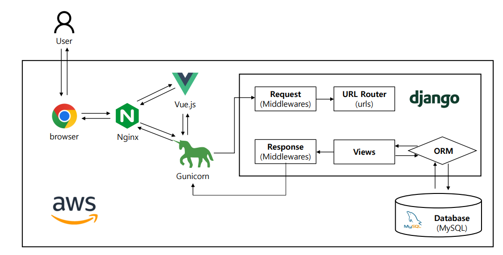
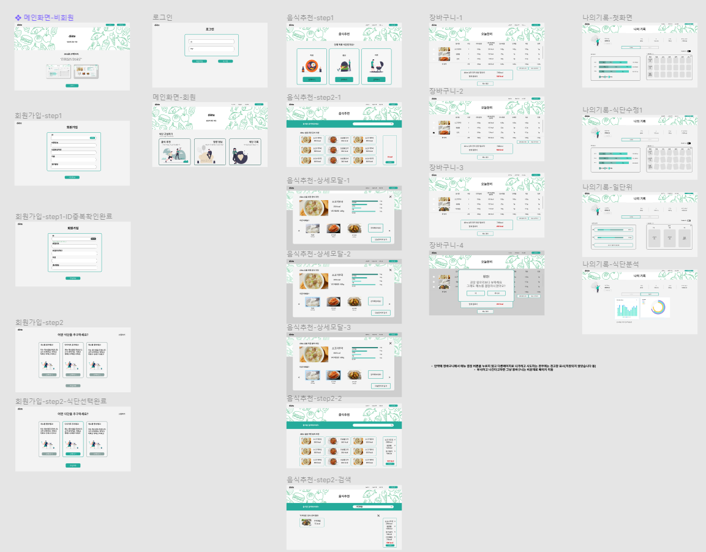
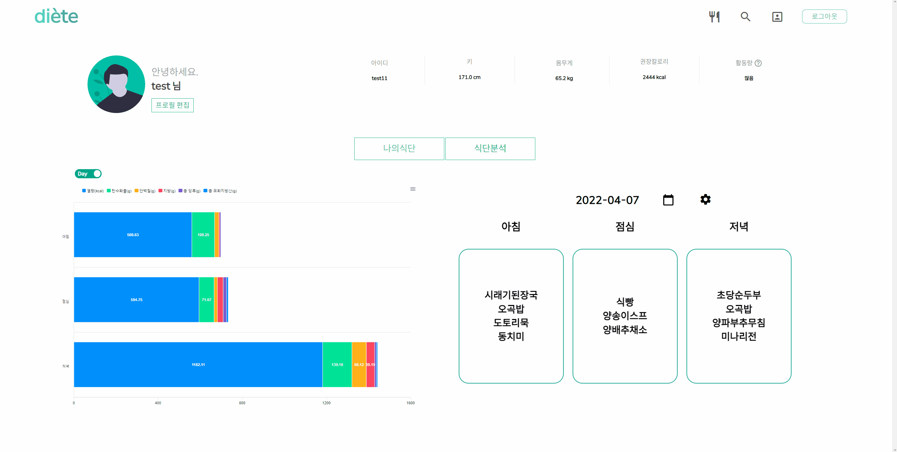
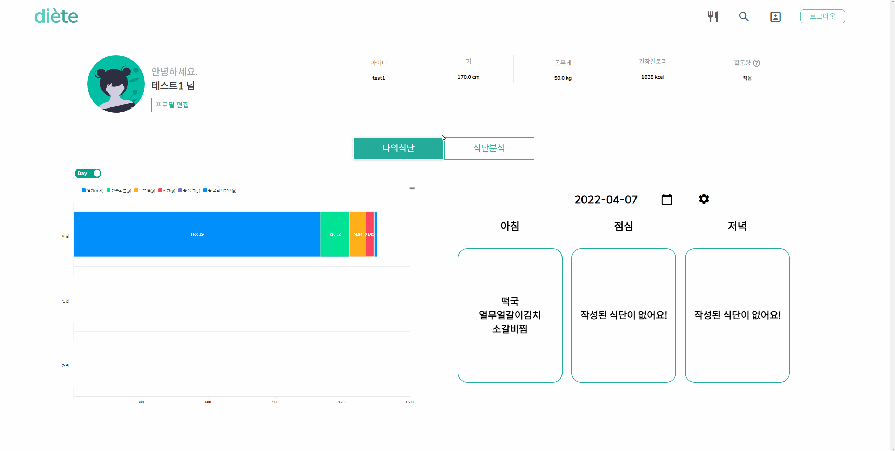

<div align="center">
    <h5>빅데이터 기반 음식 추천 서비스</h5>
    <br/><br/><br/>
</div>


##  📑 목차

---

1. 서비스 소개
2. 코드 실행 방법
3. 기술 스택 및 개발 환경
   1. 서비스 아키텍쳐
   2. ERD
   3. 와이어프레임
   4. Git Policy
4. 구현 기능
5. 팀원 소개


## 1. 서비스 소개

---

 식단으로 인한 각종 질환들을 예방하고 관리하기 위하여 빅데이터를 활용한 "**음식 추천 서비스**"를 제공하며, 영양 정보를 확인할 수 있는 맞춤형 식단 관리를 제공하는 서비스입니다.
 사용자의 키, 몸무게, 성별, 활동량을 통하여 건강한 식단을 관리할 수 있도록 음식을 추천하며, 음식에 대한 영양 정보까지 제공합니다. 저장된 식단들은 나의 기록 페이지에서 한 눈에 볼 수 있는 다양한 그래프로 확인하며 식단을 관리할 수 있도록 도와드리는 서비스입니다.


## 2. 코드 실행 방법

---

### Download

```bash
git clone https://lab.ssafy.com/s06-bigdata-rec-sub2/S06P22B104.git
```

### Front

```bash
cd Client
npm i
npm run serve
```

### Backend

```bash
cd Server
pip install -r requirements.txt
python manage.py migrate
python manage.py runserver
```


## 3. 기술 스택 및 개발 환경

---

### 🧱 서비스 아키텍쳐



### 🧩 ERD


### 🖼 와이어프레임



### 📮 Git Policy

```bash
Commit message Rule : git commit -m “{TAG}: {TITLE} \ {BODY}”
예시) git commit -m “Feat: 로그인 기능 추가”
```

| TAG      | Description                  | Example          |
| -------- | ---------------------------- | ---------------- |
| Feat     | 기능 관련 추가/수정하는 경우 | 로그인 기능 추가 |
| Fix      | 버그수정                     | 버그 수정        |
| Design   | CSS 등 사용자 UI 디자인 변경 | 버튼 UI 변경     |
| Docs     | 문서를 수정한 경우           | README 수정      |
| Refactor | 코드 리팩터링할 경우         |                  |

* branch 규칙
  * master : 최종 완성된 프로젝트를 관리(배포 브랜치)
  * develop : FE와 BE를 병합하여 개발단계의 프로젝트를 관리(개발 브랜치)
  * FE & BE : 프론트엔드 / 백엔드 팀 각각 기능별로 하위 브랜치를 생성해서 개발
  * feature/’기능명’ : 각 브랜치에서 기능별로 하위 브랜치를 생성하여 분업환경 조성


## 4. 구현 기능

비회원 페이지


회원가입 후 로그인 페이지


음식추천 및 검색 페이지


장바구니 페이지

식단 분석 페이지



프로필 편집




## 5. 팀원 소개

---

| 팀원   | 역할            | Gitlab         |
| ------ | --------------- | -------------- |
| 김수용 | 팀장 (Backend)  | kst2575        |
| 길기호 | 팀원 (Backend)  | kgh01509       |
| 김나린 | 팀원 (Backend)  | narin          |
| 이가은 | 팀원 (Backend)  | rkdms0116      |
| 이진석 | 팀원 (Frontend) | asooso1        |
| 한채은 | 팀원 (Frontend) | onehousesilver |

