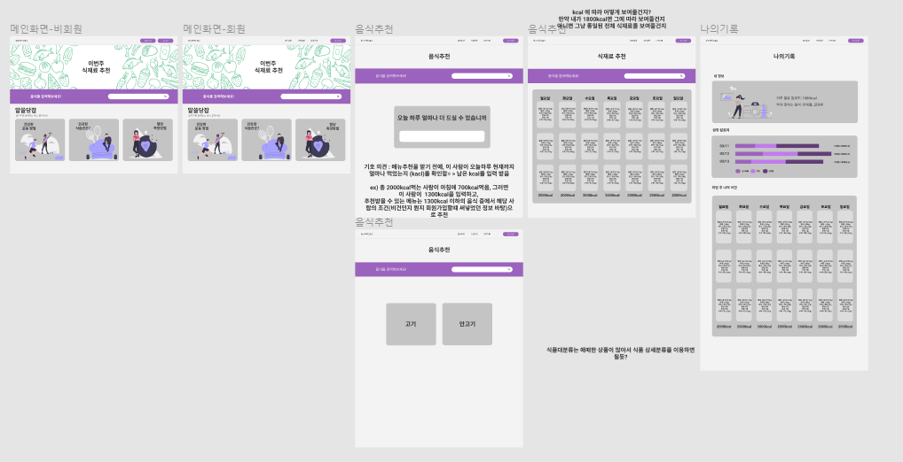

22.03.10

#### 피그마 제작( 채은이거에 숟가락 )

####  서비스 제공 방식에 대한 고민

- 채은 : 아침, 점심, 저녁 kcal 입력 받고 그에 따라 6 식품군에 따른 식단 추천
- 기호 : 사용자의 잔여 kcal에 따라 음식, 식단 추천
- 수용 : 메인 메뉴 추천 받고 나머지 메뉴 검색 서비스 이용해서 장바구니
- 진석&나린 : 메인 메뉴 추천 받고, 그에 맞는 식단에 몇 가지 선택지를 제공한 후, 장바구니에 담아서 저장

#### 메뉴추천을 하기위한 메뉴선정기준 선택하기... -> 어려움 

1. 선호정보 (안고기 , 고기)를 몇가지?의 카테고리로 나눌것인지..

2. 대분류, 상세분류 어떤것으로 나눌것인지/..

제
