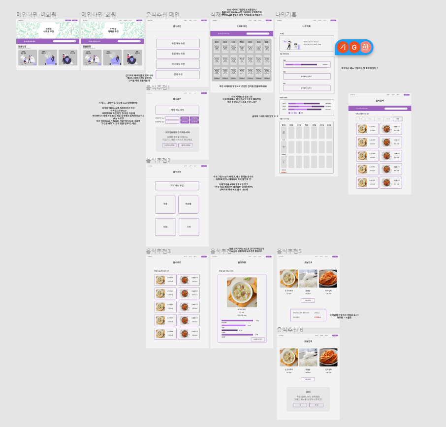

# 3월 8일 🔮

### 오늘의 목표 🎯

> 오늘 해야할 일을 간단하게 정리합니다.

- [x] 기획 디테일 공유하기
- [ ] 기획 구체화 완료하기
- [ ] 서비스 네이밍

###  오늘의 회의 👥

> 오늘 어떤 회의를 했는지 간단하게 정리합니다.

- 각자 쉬는 동안 기획 디테일 잡아서 공유하기

- 서비스 네이밍을 어떻게 할건지

- 내일 있는 전문가 리뷰에 질문을 어떻게 할지

  

### 오늘의 해결 💡

> 오늘 어떤 일을 했는지 간단하게 정리합니다.

- 나의 기획 디테일 의견
  - 아침, 점심, 저녁 kcal 입력 받고 그에 따라 6 식품군에 따른 식단 추천
  - 피그마를 통해 정확하게 프로젝트를 정확하게 이해하고 있는건지 생각해보고 보기 쉽게 정리
  - 

​				https://www.figma.com/file/z5rjjzSWeHbr8mg8t91aMW/Untitled

**음식 추천 기능 취합**

- 사전조사
- 음식을 선택 후 마이페이지(장바구니로)
  - 마이페이지에서 식단, 칼로리, 당 등을 관리
- 음식을 추천받으며 장바구니에 담아 나만의 식단을 완성
- 음식을 모두 골랐다면 장바구니 상세 보기 페이지로 넘어감
  - 상세 보기 페이지에서는 지금까지 고른 음식들의 세부 영양소 정보 등이 나열되고 총 열량 및 영양소 등을 보여줌
- 음식을 추천하는 방법
  - 매 끼니마다 최소한의 선호정보 조사
    - 선호정보 : 이지선다 느낌으로 서너 개 → 2차 필터링에 활용
    - 선호정보: 식품대분류 기준으로 나누기

### 오늘의 느낀점 ✏

> 오늘의 느낀점을 정리합니다.

- 다같이 문서화해서 공유하니까 확실이 이해도 쉬웠고, 진석님 말처럼 동일하게 생각하고 있는 부분이 있어 취합하기에 어렵지 않았다.
- 점점 구체화 되는거 같아서 뿌듯하고 내일이면 와이어프레임을 시작했으면 좋겠다.
